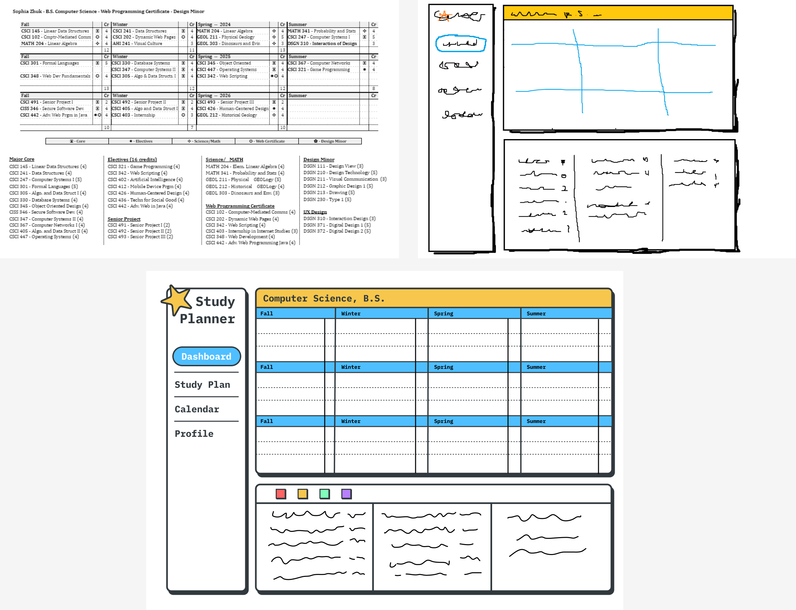

# Study Planner

## Introduction
Study Planner is a web application designed to help students organize their academic schedule efficiently. It allows users to drag and drop courses into their desired term, enabling easy visual planning of their academic journey. The planner categorizes courses into Core, Elective, Senior, and Science, with a color-coded system for quick identification.
- Currently, the web app only contains the Computer Science Major at Western Washington University.
- Eventually I would like to web scrape for all of the Majors at this institution.

## Features
- **Drag and Drop Interface**: Intuitively drag courses from the course list into the desired term on your study plan.
- **Course Categorization**: Courses are categorized into Core, Elective, Senior, and Science, each represented by different colors.
- **Persistent State**: The state of your study plan is saved in cookies, so your layout remains intact even after refreshing the page.

## Use
To test out the study planner, you can use my github pages link. https://sophiazhuk.github.io/study-planner/

## Technologies Used
- HTML5
- CSS3
- JavaScript
- Bootstrap 5

## Wireframing
Here are the wireframes that guided the design of the Study Planner:
- The first wireframe was a study planner I was initially using in Google Docs.
- The second was the low fidelity wireframe to sketch out my idea.
- The last one is my high fidelty wireframe made in Figma.

